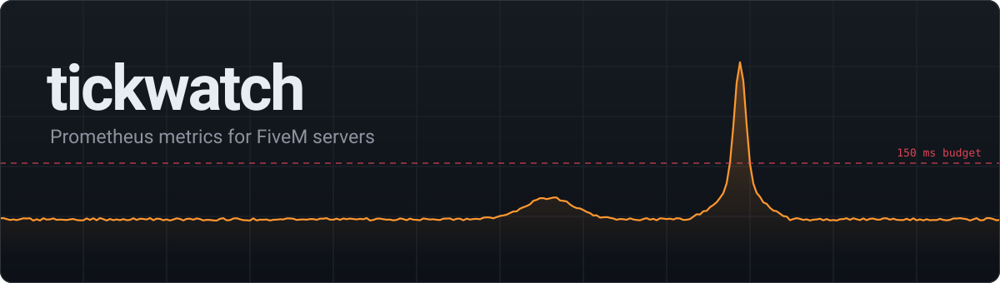
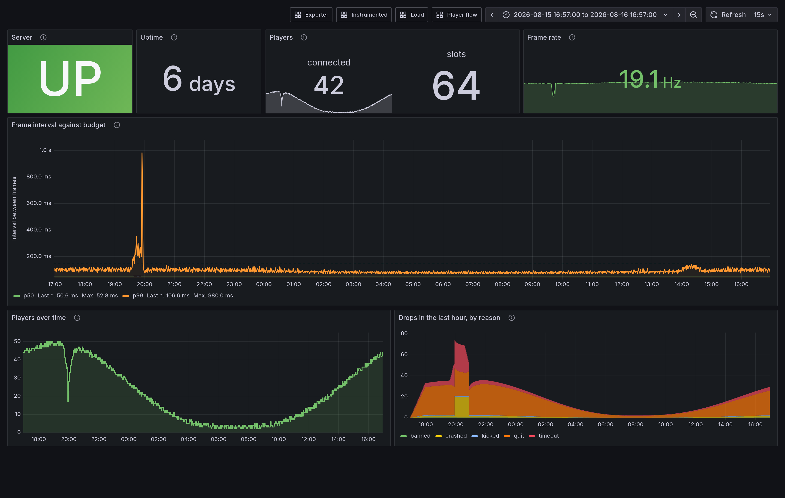

Drop-in resource, no framework dependency, MIT. Runs on QBCore, ESX or a bare server, and
ships with a `docker compose` stack that brings up Prometheus and Grafana with dashboards
already provisioned.

## What you get

Tick timing, player counts and connection flow, ping distribution, session length, entity
counts, resource up/down — plus an API so your own resources can publish metrics through it.

Collection runs on a fixed schedule and the scrape endpoint only ever serves a cached
payload, so the number of people scraping you has no effect on your server's main thread.
Measured against a running server: the exporter's own cost is **−0.01 ± 0.04 ms** on the
frame interval, which is inside the noise.

## Metrics

23 metrics in four groups. Cardinality is bounded by construction — nothing is ever labelled
by player id, licence or IP, and every metric carries a cap on unique label combinations.

**The server** — always present.

| metric | type | labels |
|---|---|---|
| `fivem_server_up` | gauge | |
| `fivem_server_uptime_seconds` | gauge | |
| `fivem_server_info` | gauge | `version`, `gamename` |
| `fivem_server_tick_interval_seconds` | histogram | |

`tick_interval` is the gap between frames — scheduler delay, used as a proxy for load. A
healthy server sits at the 20 Hz baseline near 50 ms.

**Players** — appear once somebody connects.

| metric | type | labels |
|---|---|---|
| `fivem_players_connected` | gauge | |
| `fivem_players_max` | gauge | |
| `fivem_player_ping_seconds` | histogram | |
| `fivem_player_connections_total` | counter | `result` (`attempted`, `joined`) |
| `fivem_player_drops_total` | counter | `reason` (`quit`, `timeout`, `crashed`, `kicked`, `banned`, `server_shutdown`, `other`) |
| `fivem_player_session_duration_seconds` | histogram | |
| `fivem_entities` | gauge | `type` (`ped`, `vehicle`, `object`) |
| `fivem_resource_up` | gauge | `resource` |

Drop reasons are free text from `DropPlayer`, so they are normalised to that fixed enum before
becoming a label. Join success rate is `joined / attempted` — see the limitations below for
why there is no `rejected`.

**Pushed by your resources** — empty until you call the export API.

| metric | type | labels |
|---|---|---|
| `fivem_events_total` | counter | `event` |
| `fivem_event_duration_seconds` | histogram | `event` |
| `fivem_db_queries_total` | counter | `op`, `status` (`ok`, `error`) |
| `fivem_db_query_duration_seconds` | histogram | `op` |

**tickwatch itself** — what the tool costs and whether it is healthy.

| metric | type | labels |
|---|---|---|
| `tickwatch_render_duration_seconds` | histogram | |
| `tickwatch_collector_overhead_seconds` | histogram | |
| `tickwatch_lua_memory_bytes` | gauge | |
| `tickwatch_cache_age_seconds` | gauge | |
| `tickwatch_scrapes_total` | counter | `result` (`served`, `deferred`, `dropped`, `unauthorized`) |
| `tickwatch_export_errors_total` | counter | `reason` |
| `tickwatch_series_dropped_total` | counter | `metric` |

The two duration histograms measure microseconds through a 1 ms clock, so read them as
`_sum / _count` and do not put a `histogram_quantile` on them. `series_dropped_total` is the
cardinality cap biting; if it is non-zero, a label somewhere is unbounded.



> **Synthetic data.** The screenshot is generated, not captured from a live server — see
> [dashboards/demo](dashboards/demo). Every measurement quoted in this README and in `docs/`
> is real.

The moment above is the kind of thing these dashboards exist for: the frame interval blows
out to 980 ms, the frame rate halves, and 22 players disappear — and the drop-reason
breakdown says `crashed` and `timeout` rather than `quit`, so you know they did not choose to
leave. The database dashboard shows the query latency that caused it, half an hour earlier.

## Quick start

**1. Install the resource.**

```bash
cd resources
git clone https://github.com/ArChrisVa/Tickwatch.git tickwatch
```

**2. Set a scrape token** in `server.cfg`, then `ensure tickwatch`:

```cfg
set tickwatch_token "a-long-random-string"
ensure tickwatch
```

> Use `set`. Not `sets`, which publishes the token in your server's public `/info.json`
> (tickwatch refuses to start if it finds it there), and not `setr`, which sends it to every
> connecting client.

Metrics are now at `http://your-server:30120/tickwatch/metrics`, bearer-token authenticated.

**3. Bring up the dashboards:**

```bash
cd tickwatch/dashboards
printf '%s' 'a-long-random-string' > secrets/tickwatch_token
# edit prometheus/prometheus.yml if your server isn't on the same host at :30120
docker compose up -d
```

Grafana on http://localhost:3000 (`admin` / `admin`).

## Configuration

All optional — the defaults are fine for most servers.

| convar | default | |
|---|---|---|
| `tickwatch_token` | *(none)* | **required**; the exporter refuses to start without it |
| `tickwatch_enabled` | `true` | |
| `tickwatch_render_interval_ms` | `5000` | how often the payload is rebuilt |
| `tickwatch_max_age_ms` | `15000` | older than this and a scrape waits for a fresh render |
| `tickwatch_series_cap` | `500` | max unique label combinations per metric |
| `tickwatch_players_interval_ms` | `10000` | `0` disables |
| `tickwatch_entities_interval_ms` | `10000` | `0` disables |
| `tickwatch_resources_interval_ms` | `30000` | `0` disables |

Bad values are clamped and reported at startup rather than being fatal.

## Instrumenting your own resource

```lua
exports['tickwatch']:Register({
    name = 'myjob_payouts_total', type = 'counter',
    help = 'Payouts made.', labels = { 'job' },
})

exports['tickwatch']:Inc('myjob_payouts_total', { job = 'trucker' })
```

Writes return `false` instead of raising, so a mistake in your metrics can't take your
resource down. Rejections are printed once and counted in `tickwatch_export_errors_total`.

**Load order does not matter.** tickwatch checks its own `/info.json` before it starts
serving, which takes an HTTP round trip, so your resource will usually call `Register` before
tickwatch is ready no matter where you put `ensure tickwatch`. Declarations that arrive early
are held and replayed the moment it binds. If you would rather wait explicitly:

```lua
AddEventHandler('tickwatch:ready', function() ... end)
```

For timing, use the wrapper — it catches early returns and errors, which hand-written timing
silently skips, and the error path is usually the slow one:

```lua
-- in your fxmanifest.lua
server_scripts { '@tickwatch/shared/timed.lua', 'server/main.lua' }

-- then wrap once
payout = TickwatchTimed('myjob_payout_duration_seconds', payout)
```

## What it can't do

- **No per-resource CPU attribution.** The platform exposes no interface for it — the profiler
  natives are write-only. tickwatch reports *that* the server stalled, not which resource did
  it. Attribution is opt-in, via the wrapper above.
- **The memory gauge is tickwatch's own heap**, not the server's. Same platform boundary.
- **Timing resolution floors at 1 ms** (`GetGameTimer` is integer milliseconds), and the tick
  metric floors at the 50 ms frame period. For sub-millisecond work read `_sum / _count`, not
  `histogram_quantile`.
- **A token set with `setr` can't be detected** from inside the server. The `sets` case is,
  and refuses startup — so the check catches one of the two bad verbs.
- **The endpoint is bearer auth over plaintext HTTP** on the public game port. Put it behind a
  proxy or a firewall rule for anything real.

## Troubleshooting

**It refuses to start.** By design — the checks fail closed. The console says which one:

| message | cause |
|---|---|
| `tickwatch_token is not set` | Add `set tickwatch_token "..."` to `server.cfg`. |
| `the scrape token is publicly readable in ...` | You used `sets`, which publishes it in the public `/info.json`. Switch to `set` **and rotate the token** — assume it is compromised. |
| `could not read http://127.0.0.1:PORT/info.json` | tickwatch could not reach its own server to run that check. Check the port in the message matches the one your server listens on, and set `endpoint_add_tcp` if it does not. This takes ~33 s to give up. |
| `disabled by convar` | `tickwatch_enabled` is false. |

**A scrape returns 401.** The token in `secrets/tickwatch_token` must match `tickwatch_token`
on the game server exactly. A trailing space in `server.cfg` is trimmed and reported at
startup — check the console. Header case does not matter.

**Panels are empty.** The player, entity and resource metrics only appear once there is
something to report, so an empty server shows nothing for most of them. The `Instrumented`
dashboard stays empty until one of your own resources calls the export API. If you have added
those calls and it is still empty, check `tickwatch_export_errors_total` on the `Exporter`
dashboard — that is where a wrong metric name goes.

**`setr` is not detected.** A token set with `setr` is pushed to every connecting client and
cannot be detected from inside the server. tickwatch catches the `sets` case only, so the
startup gate is not a guarantee that your token is private.

## Docs

- [docs/design.md](docs/design.md) — what each part does and why it's shaped that way
- [docs/platform-notes.md](docs/platform-notes.md) — measured FXServer behaviour the design
  depends on, most of it undocumented upstream
- [tools/probe/](tools/probe) — the resource that produced those measurements
- [dashboards/demo/](dashboards/demo) — the synthetic dataset behind the screenshot

`npm test` runs 176 tests over the shipping Lua in a WebAssembly Lua VM.

## License

MIT — see [LICENSE](LICENSE).
